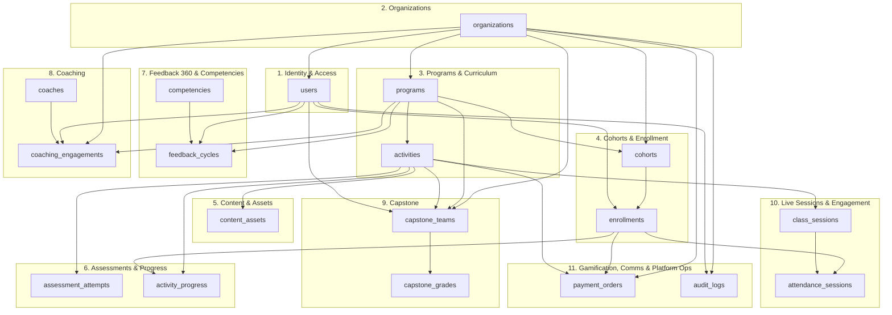

# XA-LMS — Database Architecture (Conceptual)

The physical schema spans ~110 tables across 30 backend modules (`api/internal/{module}/`). This document groups those tables into 11 logical components and shows how their **anchor tables** — the one or two tables each component's other tables hang off — relate to one another. It is intentionally a conceptual view: no columns, no data types, no non-anchor tables. For the full per-component table listing, see the conversation/PR that generated this doc, or grep `TableName()` across `api/internal/*/model.go`.

## Components

1. **Identity & Access** — Users, sessions, roles, and permission assignments. The root of every actor in the system (participant, coach, faculty, admin).
2. **Organizations** — Multi-tenancy root. Every other component's data is ultimately scoped to an `organizations` row.
3. **Programs & Curriculum** — The configurable curriculum tree (`programs` → phases → modules → `activities`). `activities` is the platform's core building block — every learning step (content, assessment, survey, coaching, capstone) attaches here.
4. **Cohorts & Enrollment** — Groups learners into a running instance of a program and tracks who is enrolled.
5. **Content & Assets** — Uploaded/generated learning material (documents, videos, slides) attached to activities.
6. **Assessments & Progress** — Quiz/test attempts and generic per-learner activity completion tracking.
7. **Feedback 360 & Competencies** — Multi-rater feedback cycles scored against a shared competency taxonomy.
8. **Coaching** — One-on-one coach↔participant engagements, notes, and goals.
9. **Capstone** — Team-based capstone projects: formation, milestones, peer/panel review, grading, certification.
10. **Live Sessions & Engagement** — Scheduled live sessions (Zoom-backed), attendance, and community features (discussions, DMs, announcements).
11. **Gamification, Comms & Platform Ops** — Cross-cutting services: payments, notifications/email, leaderboard scoring, compliance/audit, and AI (chat, RAG, risk scoring).

## Conceptual ER Diagram (Anchor Tables Only)

## Reading the diagram

- **`organizations`** fans out to nearly every component — it's the tenancy boundary, not a functional relationship.
- **`programs` → `activities`** is the curriculum spine; almost every other component (content, assessments, sessions, capstone) attaches to a specific `activities` row rather than directly to a `programs` row.
- **`enrollments`** is the join point between a learner (`users`) and a running cohort — most learner-facing progress/attendance/payment records key off it.
- **`coaching_engagements`**, **`feedback_cycles`**, and **`capstone_teams`** are peer components: each is scoped to an org/program and references `users` independently, but they don't reference each other directly.
- Component 11 (Gamification, Comms & Platform Ops) is intentionally peripheral — `payment_orders` and `audit_logs` are referenced by other components rather than driving them.
